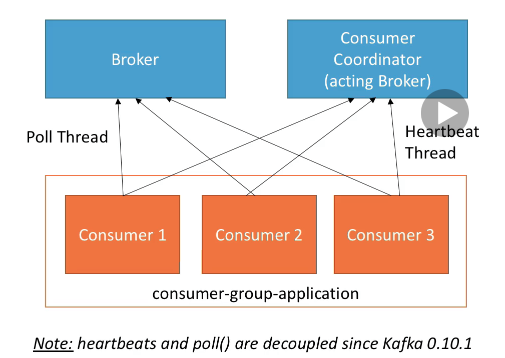

# Kafka Consumer
In a situation where the consumption need to replay for investigation purpose, the offset can be reset.
For example the initial offsets of partitions for a given topic of a consumer group is as below,

`describe a topic`

```shell
kafka-consumer-groups --bootstrap-server 127.0.0.1:9092 --group tweet_squad --describe
```

```shell
GROUP           TOPIC           PARTITION  CURRENT-OFFSET  LOG-END-OFFSET  LAG             CONSUMER-ID     HOST            CLIENT-ID
tweet_squad     tweety          1          933             933             0               -               -               -
tweet_squad     tweety          0          908             908             0               -               -               -
tweet_squad     tweety          2          920             920             0               -               -               -
```

`LAG` 0 means no more message in the topic is available for the `tweet_squad` consumer group. Means, all messages are consumed by the consumer with this group.
To let the same consumer group consuming the messages, reset the offset.

```shell
kafka-consumer-groups --bootstrap-server 127.0.0.1:9092 --group tweet_squad --reset-offsets --execute --to-earliest --topic tweety
```

If everything is ok, the command will be successful,

```shell
GROUP                          TOPIC                          PARTITION  NEW-OFFSET     
tweet_squad                    tweety                         0          0              
tweet_squad                    tweety                         1          0              
tweet_squad                    tweety                         2          0   
```

Now run again the `describe` consumer group

```shell
kafka-consumer-groups --bootstrap-server 127.0.0.1:9092 --group tweet_squad --describe
```

It should give the result with LAG > 0, and current offset are set to 0.

```shell
GROUP           TOPIC           PARTITION  CURRENT-OFFSET  LOG-END-OFFSET  LAG             CONSUMER-ID     HOST            CLIENT-ID
tweet_squad     tweety          1          0               933             933             -               -               -
tweet_squad     tweety          0          0               908             908             -               -               -
tweet_squad     tweety          2          0               920             920             -               -               -
                                                                                        
```

and `CURRENT-OFFSET` is 0

Restart the consumer.
This time, the consumer should be able to consume the message.

# Controlling Consumer Liveliness



* Consumers in a group talks to a Consumer Groups Coordinator
* To detect consumers that are down, there is `heartbeat` mechanism and a `poll` mechanism
* To avoid issues, consumers are encouraged to process data fast and poll often

# Consumer Heartbeat Thread

* session.timeout.ms (default 10 seconds)
> Heartbeat are sent periodically to the broker
> If no heartbeat is sent during that period, the consumer is considered dead
> Set even lower to faster consumer re-balancing

* heartbeat.interval.ms (default 3 seconds)
> How often to send heartbeats
> Usually set to 1/3rd of `session.timeout.ms`


* This mechanism is used to detect a consumer application being down

# Consumer Poll Thread
`max.poll.interval.ms` (default 5 minutes)

* Maximum amount of time between two .poll() calls before declaring the consumer dead
  ```java
  while (true) {
     
        consumer.poll(Duration.ofMillis(100)).forEach(p -> {
              //the business logic to process the message
              //may take time
              //if it is more than 100 ms, then the consumer will be considered dead,
              //because the next poll will be too late
        );

    }
 ```
* This is particularly relevant for Big Data frameworks like Spark in case processing takes time
* This is used to detect a data processing issue with the consumer

# Delete kafka messages from topic
Make it invalid instead of deleting it, by setting the `retention.ms=1000`.
The command is given as below,

```shell
kafka-topics --zookeeper 127.0.0.1:2181 --alter --topic tweety --config retention.ms=604800000
```
Once done, the consumer will not consume the existing messages


